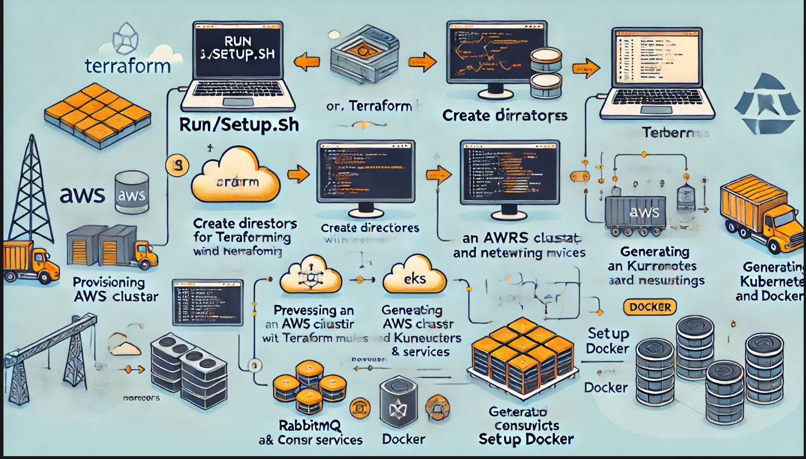
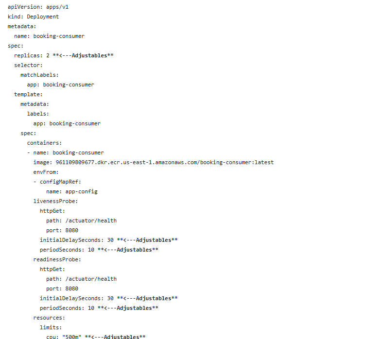
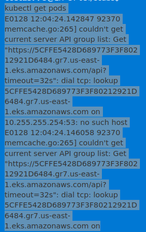

# JavaSpringBoot Modules deployed using a script in AWS!

## Assumptions
* I'm assuming fire and forget approach - API endpoint is publishing message and not waiting for confirmation, returning HTTP 202 Accepted because data will be processed later in consumer
* I'm assuming that client application is holding the state of booking, and is able to use generated UUIDs for PUT and DELETE operations

## Solution 

### Modules
* booking-producer-service - Implements API, basic validation and produce RabbitMQ messages.
* booking-consumer-service - Implements RabbitMQ listeners, "business logic" and persistence.
* booking-contract - contains DTO objects and Consts shared between both applications. This module is communication contract.

### Known issues/limitations
* error handling is limited to bare minimum - real world application should handle much more edge cases based on requirement
* only integration test provided - because application has almost no business logic I provided only integration tests. Test coverage is > 80%.
* faulty, not processed messages are redirected to Dead Letter Queue 

### Endpoints documentation
Endpoints documentation is generated on the fly in OpenAPI format by booking-producer-service
http://localhost:8080/swagger-ui/index.html

### Deployment of the script

Once you run **setup.sh** the following detailed Script Actions will occur:

**1. Directory Setup**
Creates directories for:
Terraform modules and environments.
Kubernetes manifests for RabbitMQ, producer, consumer, configmaps, and secrets.
Docker configurations for producer and consumer services.

**2. Terraform Modules**
EKS Module:
Provisions an EKS cluster with managed node groups.
Configures public/private endpoint access.
Specifies instance types and scaling properties for the node groups.
Networking Module:
Creates a VPC with public and private subnets.
Enables a single NAT gateway.
Tags resources appropriately for Kubernetes.

**3. Terraform Environment Configuration**
Environment-specific files include:
provider.tf: Defines AWS and Kubernetes providers.
main.tf: Integrates the networking and EKS modules.
variables.tf: Defines configurable parameters (e.g., region, subnets).

**4. Kubernetes Manifests**
Producer:
Defines a deployment and service for a booking-producer application.
Configures liveness/readiness probes, resource limits, and environment variables from a config map.
Consumer:
Similar to the producer, with its deployment and configuration.
RabbitMQ:
Configures RabbitMQ as a stateful service with liveness/readiness probes.
Exposes ports for AMQP and management interfaces.

**5. Docker**
Prepares directory structure for producer and consumer Dockerfiles, though no specific Dockerfiles are created in this script.
Purpose
This script is designed to bootstrap an environment for deploying an application involving:

**AWS Infrastructure:**
Sets up the networking and compute resources using Terraform.
Kubernetes Cluster:
Configures EKS for container orchestration.
Application Deployment:
Provides manifests for deploying services like RabbitMQ, producer, and consumer in Kubernetes.
Docker Preparation:
Sets up a directory for building Docker images for the applications.

## **Usage**
Pre-requisites (use the commands below to check if you have anything missing)
* AWS CLI configured with access credentials: aws --version
* **IE generate both Access and Secret Key on AWS IAM**
* Kubernetes: **kubectl version --client**
* Terraform: **terraform version**
* Docker: **docker --version**
* GIT: **git --version**
* JAVA: **java -version**
* MAVEN: **mvn -version**

* If any of the above is missing
* **sudo apt update** (followed by)
* **sudo apt install** (application name)

* WSL2 environment (mine is Ubuntu)
* **cat /etc/os-release** 

## **Setup**
* **aws configure** 
* AWS Access Key ID [****************5YIV]: 
* AWS Secret Access Key [****************L8ts]: 
* Default region name [us-east-1]: 
* Default output format [None]:
* **NOTE: put in the Access key and Secret Access Key you created earlier in IAM with the region name. Press enter after entry (choose None for Default output format)**

* From the Linux CLI: **git clone https://github.com/costas778/JavaSpringBoot.git**
* from the root of the folder structure locate the setup.sh, and use the following command: **chmond +x setup.sh**
* finally, type in he Linux CLI the following: **./setup.sh**

* You should get the following:

## **Testing**

### Check the pods
  
* **kubectl get pods -w**
  
* NAME                                READY   STATUS    RESTARTS   AGE
* booking-consumer-6d9f74974-84xlw    1/1     Running   0          12h
* booking-consumer-6d9f74974-slf9r    1/1     Running   0          12h
* booking-producer-845b699bdd-56qlm   1/1     Running   0          8h
* booking-producer-845b699bdd-j7s6l   1/1     Running   0          8h
* rabbitmq-5cfd974bf6-zd8xm           1/1     Running   0          33h

### Check service types
kubectl get svc -o wide

### Check ConfigMaps
kubectl get configmaps

### Check environment variables in deployments
kubectl get deployments -o yaml

## **Troubleshooting Commands**

### 1. containers that keep crashing and restarting
**kubectl get pods -w**
* NAME                                READY   STATUS    RESTARTS      AGE
* booking-consumer-54598b877d-7h7mf   0/1     Running   1 (14s ago)   66s
* booking-consumer-54598b877d-hmbdh   0/1     Running   1 (15s ago)   66s
* booking-producer-845b699bdd-85bk5   1/1     Running   0             63s
* booking-producer-845b699bdd-vd727   1/1     Running   0             63s
* rabbitmq-5cfd974bf6-zd8xm           1/1     Running   0             103m
* booking-consumer-54598b877d-7h7mf   0/1     Running   2 (1s ago)    112s
* booking-consumer-54598b877d-hmbdh   0/1     Running   2 (1s ago)    112s
* booking-consumer-54598b877d-hmbdh   0/1     Running   3 (1s ago)    2m52s
* booking-consumer-54598b877d-7h7mf   0/1     Running   3 (0s ago)    2m53s

* ** This is, likely, due to resources for the containers or / and connexctivity issues!**

### Gathering logs for consumer pods
kubectl logs -l app=booking-consumer --tail=100

### Gathering logs for producer pods
kubectl logs -l app=booking-producer --tail=100

### Gathering verbose details for a managed pod
kubectl describe pod -l app=booking-consumer

### Delete existing pods (Kubernetes will automatically recreate them with the new configuration)
kubectl delete pod -l app=booking-consumer
kubectl delete pod -l app=booking-producer

### We might need to adjust the probe timing in the Kubernetes deployment. 

### Searching for the settings to apply Vertical Scaling of resources! 
find . -name "*deployment*.yaml" | grep <e.g. consumer>

cat ./kubernetes/consumer/deployment.yaml 

### Now to apply changes to a YAML after editing. 
kubectl apply -f deployment.yaml 

### If that fails you may need to rebuild the images and reploy them to the EKS!

### 2. Having issues seeing your cluster from another machine.

A few useful steps:
* **unset AWS_ACCESS_KEY_ID**
* **unset AWS_SECRET_ACCESS_KEY**
* **unset AWS_SESSION_TOKEN****

Then try **aws configure again**

If that fails:
**aws eks list-clusters**

if you can see your cluster let's update your kubeconfig to connect to this cluster with the following command:

aws eks update-kubeconfig --name dev-ecabs-cluster --region us-east-1

Now try the following:
**kubectl get pods -w**

## 3. Troubleshooting tools
If you find any issues with a container image that is deployed and you are loathed to rebuild the whole enviornment from scratch using setup.sh
there are two bash scripts uploaded to facilatate this.

There is **build_and_push_cons.sh** for the booking-consumer service image &
There is **build_and_push_prod.sh** for the booking-producer service image.

The scripts are designed to build and push a Docker container for a booking service to Amazon ECR (Elastic Container Registry).

Here's a breakdown of what the script does:

### **Sets up variables:**
Enables debug output with **set -x**
Authenticates with Amazon ECR:

### **Builds the Java application:**
Changes to the particular service directory

### **Uses Maven wrapper ( ./mvnw) to create a JAR file, skipping tests:**
**./mvnw clean package -DskipTests**

### **Builds the Docker image:**
Returns to the project root

### Builds using a Dockerfile located at docker/<service>/Dockerfile
**docker build -t $IMAGE_NAME -f "$PROJECT_ROOT/docker/consumer/Dockerfile" .**

### **Tags and pushes to ECR:**

This script is part of a CI/CD process for deploying the booking consumer microservice, specifically:

* Building the Java application
* Creating a Docker container
* Publishing it to Amazon ECR in the us-east-1 region

The script includes error checking and debug output to help troubleshoot any issues during the build and push process.

This script essentially gives you a focused tool for managing a particular service deployment, which is particularly valuable during development and troubleshooting phases.

**NOTE:** do not forget to apply permissions to your bash scripts.

**chmod +x build_and_push_cons.sh**
**chmod +x build_and_push_prod.sh**

**./build_and_push_prod.sh**
**./build_and_push_cons.sh**

## 4. Destorying your setup
The cloud is like a taxi. That is its pay as you go. As long as resources exist you are paying for them. This is fine in production.
However, when you do not need these these resources its best to delete them!

The script below helps.

**NOTE:** do not forget to apply permissions to your bash scripts.
**./cleanup.sh**

**./check_resources.sh**
The above script chekcs if everything is destoryed! If the resources are not totally destoryed and your finding they are stubborn to be
removed you can make a note of these and then login to AWS and remove them manually!

## 5. A bonus script!

I also provide a bash script called **setup_gcp.sh**

THe **./setup_gcp.sh** script is intended to do what the setup.sh does in terms of CI/CD deployment on the Google GCP platform!
This will set up similar infrastructure using GKE (Google Kubernetes Engine) instead of EKS

## **Key differences from the AWS version:**

### **Uses GCP-specific services:**

### GKE instead of EKS
Google Container Registry (GCR) instead of ECR
Google Cloud VPC instead of AWS VPC

### **Authentication:**
Uses gcloud CLI instead of AWS CLI
Uses GCP service account authentication

### **Infrastructure:**
Simplified networking setup (GCP has different networking concepts)
Uses GKE-specific node pool configuration
Different firewall rules structure

### **Container Registry:**
Uses gcr.io instead of AWS ECR
Different authentication mechanism for container registry

### To use this script, you'll need:
Google Cloud SDK installed
Authenticated gcloud CLI
A GCP project created
Appropriate IAM permissions
Terraform installed
kubectl installed

### Before running, make sure to:
Set up a GCP project
Enable necessary APIs (Container Registry, GKE, Compute Engine)
Set up appropriate service account permissions
Initialize gcloud configuration

**NOTE:** This sciprt should work but requires full testing. Hence its providing on an as is basis.
